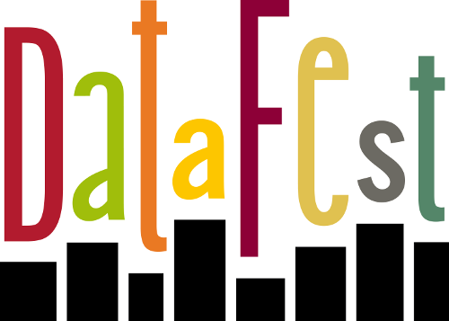

# DataFest Germany 2015
Willkommen beim DataFest Germany 2015, dem ersten seiner Art!

Die Gitlab-Gruppe [datafest2015de](https://gitlab.com/groups/datafest15de) steht 
als zentrale Plattform für die Entwicklung Eurer DataFest-Projekte zur Verfügung.

- **Um Zugriff auf die Gruppe zu bekommen legt Euch bitte zuerst einen
[Gitlab-Account](https://gitlab.com/users/sign_in) an und schickt dann eine Mail
*mit dem Benutzernamen* an gitlab@datafest.de um Zugriffsrechte zu bekommen.**

Danach könnt Ihr unter unserem gemeinsamen DataFest-Dach **[eigene Git-Projekte 
anlegen](https://gitlab.com/projects/new?namespace_id=132941)**. Bitte beachtet 
dabei immer die Nutzungsrichtlinien und geht freundlich miteinander um :) 

Ach ja und bitte denkt daran **keine Datensätze hochzuladen!** Dabei hilft es, wenn Ihr immer eine [.gitignore](./.gitignore)-Datei im 
Hauptverzeichnis Eures Projekts anlegt.

## Organisatorisches
- **Hinweise und Anleitungen von den Organisatoren findet Ihr im 
[Orga-Wiki](https://gitlab.com/datafest15de/orga/wikis/home)**
- Hinweise zur [Anreise](https://gitlab.com/datafest15de/orga/wikis/VenueandDirections)
- [Zeitplan](https://gitlab.com/datafest15de/orga/wikis/Schedule)

## Code
- [R-Code für Maltes JSON-Workshop](json.r)
- [R-Code von den NumberCrunchers (Felix, Pascal, Ulf, Sven & Theresa) für get_local_time](get_local_time.R)

## Präsentationen
- [Welcome Presentation](Welcome_Presentation_DF15DE.pdf)
- [Data Wrangling Workshop](data_wrangling_workshop.html)
- [ggplot2 Workshop](ggplot2_workshop.html)
- [RGoogleMaps Workshop](Presentation RGoogleMaps.pdf)
- [SAP Midnight Challenge](DataFest Midnight Challenge Instructions.pdf)

## Git lernen
Ein knappe Anleitung zur Einrichtung und Nutzung von Git findet Ihr im 
[Git-Guide](http://rogerdudler.github.io/git-guide/index.de.html) oder Ihr macht
gleich einen (kurzen!) [Online-Kurs](https://try.github.io/)

## Links
- [DataFest-Homepage des Lehrstuhls](http://sswml.uni-mannheim.de/Teaching/DataFest%20Germany/)
- [DataFest Germany auf Twitter](https://twitter.com/DataFestGermany)
- Twitter-Hashtag: **[#DF15DE](https://twitter.com/hashtag/DF15DE?src=hash)**
- [Facebook-Seite](https://www.facebook.com/groups/DataFestGermany/)